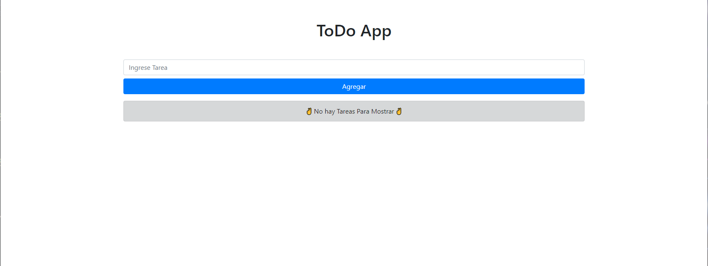
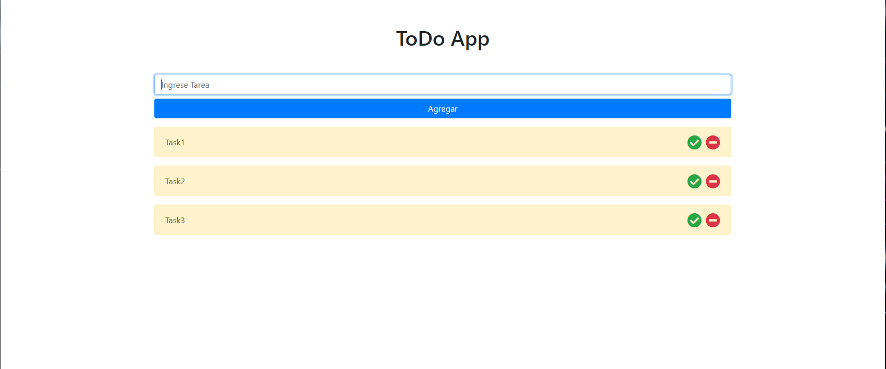
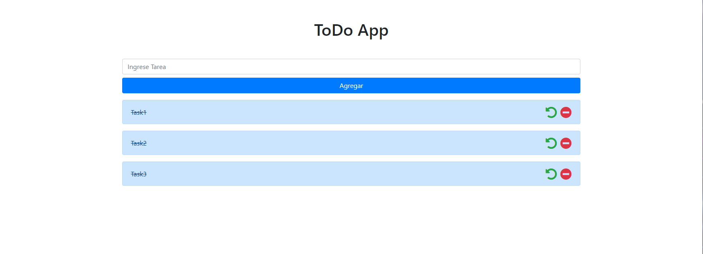

# :gear: App ToDo :gear:

## what is this project?
This project is made to practice Vanilla Javascript with Framework Boostrap4 and Font-Awesome

## How to use it?
- In the root of project press CODE button and copy the link that show with HTTPS extension
- In your local Machine just clone it

***Important***
To clone this project you have to have installed Git in your local Machine

## Info

### In this picture you can see the app don't have any task.

### In this picture you can see is with 3 tasks added.

### In this picture you can see that tasks marked with done.

## Author :book:
Roberto Palacios [Twitter](https://twitter.com/robpalacios11) | [GitHub](https://github.com/robpalacios1)

